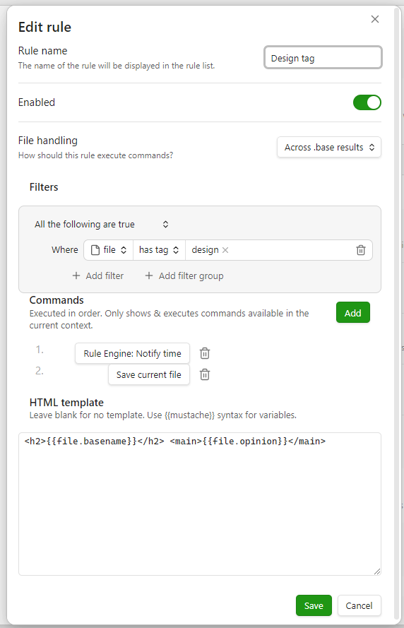
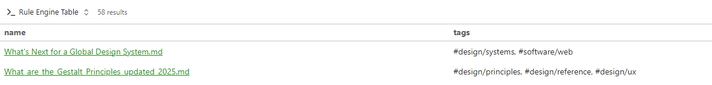
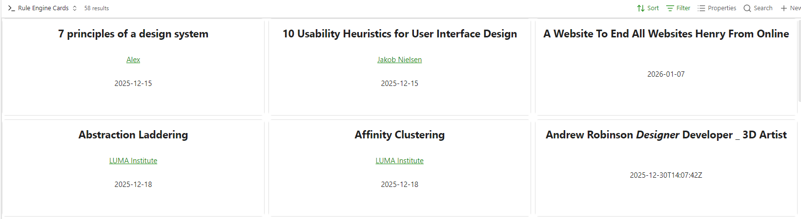
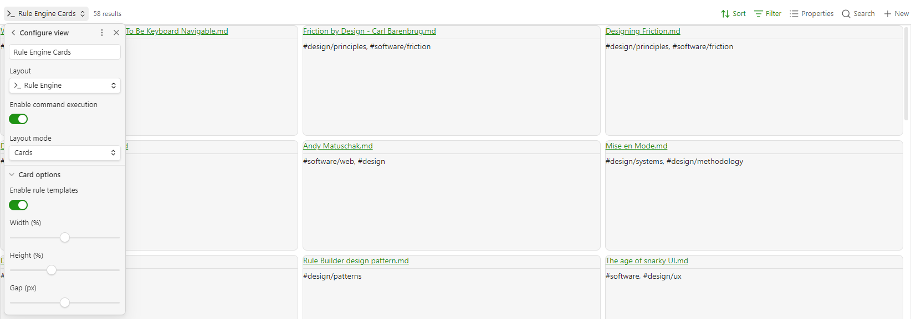
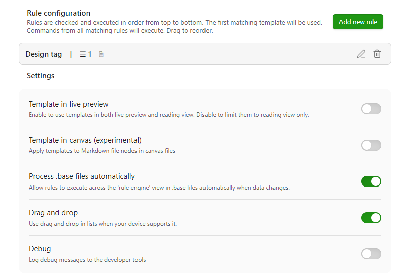

# Obsidian Rule Engine  

A plugin for [Obsidian](https://obsidian.md/) that lets you define rules to automate commands and render HTML views for your notes. Transform how your notes behave and are displayed by defining custom rules that match specific files.

_Expands on [anuwup/obsidian-custom-views](https://github.com/anuwup/obsidian-custom-views) (MIT license)._

**Features**

- render HTML templates on individual markdown files.
- render HTML templates on canvas nodes.
- render HTML templates on each `.base` item.
- automatically run list of commands against individual files.
- automatically run lists of commands against each `.base` item.



## Commands

Any command available in the current Obsidian context will be available to include in rules. When rules execute, only commands available in that context will run.
Rules are checked on individual files when they open. They are checked on `.base` results when they change. You can also use the 'process now' command to run rules on demand.

Commands from all matching rules wll execute in order.


### Provided commands

By default, commands provided by this plugin are disabled. You can enable them in the plugin settings.

- `Force template` - Apply a template to the current file regardless of rule automations and conditions.
- `Restore view` - Remove any applied templates from the current file.
- `Process now` - Check and execute automations as if the file has just been opened.
- `Notify time` - Notifies you of the current time. Used really for validating rule conditions.

## Base files

When opening or updating a Base that uses the 'Rule Engine' view, rules with the 'base' or 'both' file handling will execute commands and apply templates.

### Table layout

Execute commands against results.


## Card layout

Using the card layout you can apply matching templates to each item automatically. Since base and rule filters can differ, you can apply different templates to each card.



### Settings

Configure the layout mode, toggle command execution and templates.



## Custom Views

Use the `HTML template` field in rules to render notes using custom HTML templates. If the `template` field is blank, no template will be used. The first matching template from the list of rules will be used.


<!-- *[GIF: Show a note with frontmatter (e.g., a movie note with title, year, rating) being displayed in a custom card view instead of the default markdown view. Show the transition from default view to custom view.]* -->

**Custom views** allow you to:

- Create beautiful, custom HTML templates for specific notes
- Match files using powerful filter rules (file properties, frontmatter, tags, etc.)
- Transform data using filter chains (date formatting, text transformations, etc.)
- Render note content as markdown within your custom templates
- Render templates within base cards, to give you a customized overview.

Perfect for creating card views, dashboards, or any custom presentation of your notes!

### Usage

#### Getting Started

<!-- 1. **Enable the plugin** in **Settings → Community plugins**.
2. Go to **Settings → Rule Engine** to configure your automations.
3. Click **"Add Rule"** to create your first rule.
4. Define **filter rules** to match which files should use this view.
5. Write an **HTML template** to customize how those files are displayed. -->

#### Basic Example

Let's create a simple view for movie notes. First, add a filter rule:

- **Property**: `file.folder`
- **Operator**: `contains`
- **Value**: `Movies`

Then, create a template like this:

```html
<div class="movie-card">
	<h1>{{title}}</h1>
	<p>Year: {{year}}</p>
	<p>Rating: {{rating}}/10</p>
	<div>{{file.content}}</div>
</div>
```

Now, any note in a folder containing "Movies" will be displayed using this custom template instead of the default markdown view!

### Features

#### Filter Rules

Match files using powerful filter rules based on file properties or frontmatter. You can combine multiple conditions using AND, OR, or NOR logic.

**Available Properties:**

- **File properties**: `file.name`, `file.path`, `file.folder`, `file.size`, `file.ctime`, `file.mtime`, `file.extension`
- **Frontmatter**: Any property from your note's frontmatter (e.g., `title`, `tags`, `status`, `date`)
- **Tags**: The `tags` property (automatically detected as a list)

**Operators:**

- **Text**: `contains`, `does not contain`, `is`, `is not`, `starts with`, `ends with`, `is empty`, `is not empty`
- **Numbers**: `=`, `≠`, `<`, `≤`, `>`, `≥`, `is empty`, `is not empty`
- **Dates**: `on`, `not on`, `before`, `on or before`, `after`, `on or after`, `is empty`, `is not empty`
- **Lists/Tags**: `contains`, `does not contain`, `is empty`, `is not empty`
- **Checkboxes**: `is` (true/false)

#### HTML Templates

Write custom HTML templates using a simple placeholder syntax. Access file properties using `{{file.property}}` and frontmatter properties using `{{property}}`.

**Basic Placeholders:**

- `{{file.name}}` - The full filename (e.g., "My Note.md")
- `{{file.basename}}` - The filename without extension (e.g., "My Note")
- `{{file.path}}` - The full file path
- `{{file.folder}}` - The folder path
- `{{file.size}}` - File size in bytes
- `{{file.ctime}}` - Creation timestamp
- `{{file.mtime}}` - Modification timestamp
- `{{file.content}}` - The note body rendered as markdown
- `{{file.tags}}` - File tags (from both body and frontmatter)
- `{{property}}` - Any frontmatter property (e.g., `{{title}}`, `{{cover}}`, `{{rating}}`)

**Array Access:**

- `{{file.tags[0]}}` - First tag
- `{{file.tags[1]}}` - Second tag
- etc.

#### Filter Chains

Transform values using filter chains. Chain multiple filters together using the pipe (`|`) operator.

**Example:**

```html
<h1>{{title | capitalize}}</h1>
<p>Published: {{date | date:"MMMM DD, YYYY"}}</p>
<p>Tags: {{file.tags | join:", " | wikilink}}</p>
```

**Available Filters:**

##### Date Filters

- `date:"FORMAT"` - Format a date (e.g., `date:"YYYY-MM-DD"`, `date:"MMMM DD, YYYY"`)
- `date:"FORMAT":"INPUT_FORMAT"` - Parse and format a date with custom input format
- `date_modify:"+1 year"` - Modify a date (e.g., `"+1 year"`, `"-2 months"`)

##### Text Transformation

- `capitalize` - Capitalize first letter
- `upper` - Convert to uppercase
- `lower` - Convert to lowercase
- `title` - Title case
- `camel` - Convert to camelCase
- `kebab` - Convert to kebab-case
- `snake` - Convert to snake_case
- `trim` - Remove leading/trailing whitespace
- `replace:"search":"replace"` - Replace text (supports regex: `replace:"/pattern/flags":"replace"`)

##### Markdown Formatting

- `wikilink:"alias"` - Convert to wikilink `[[value|alias]]`
- `link:"text"` - Convert to markdown link `[text](value)`
- `image:"alt"` - Convert to markdown image ``
- `blockquote` - Convert each line to blockquote

##### Array Operations

- `split:","` - Split string into array
- `join:", "` - Join array into string
- `first` - Get first element
- `last` - Get last element
- `slice:0:5` - Slice array or string
- `count` - Get length of array or string

##### HTML Processing

- `strip_tags` - Remove HTML tags

##### Math

- `calc:"+10"` - Perform calculation (`+`, `-`, `*`, `/`, `^`)

#### View Modes

The plugin works in different view modes based on your settings:

- **Reading Mode**: Custom views always work in reading mode (preview mode).
- **Live Preview**: Optionally enable custom views in live preview mode via **Settings → Custom Views → Work in Live Preview**.
- **Source Mode**: Custom views are disabled in pure source mode (true editor mode).

#### Multiple Views

You can create multiple custom views. The plugin will use the first matching view for each file. This allows you to have different templates for different types of notes.

**Example:**

- View 1: Movie cards (matches `file.folder contains "Movies"`)
- View 2: Book cards (matches `file.folder contains "Books"`)
- View 3: Project dashboards (matches `file.status is "active"`)

#### Script Support

You can include `<script>` tags in your templates for dynamic behavior. Scripts are executed when the template is rendered, allowing you to add interactivity to your custom views.

```html
<div class="interactive-card">
	<h2>{{title}}</h2>
	<button onclick="toggleDetails()">Show Details</button>
	<div id="details" style="display: none;">{{file.content}}</div>
</div>

<script>
	function toggleDetails() {
		const details = document.getElementById("details");
		details.style.display =
			details.style.display === "none" ? "block" : "none";
	}
</script>
```

> [!WARNING]
> Scripts in templates are executed when the view is rendered. Be careful with scripts from untrusted sources.

### Examples

#### Movie Card View

**Filter Rule:**

- `file.folder` contains `Movies`

**Template:**

```html
<div
	class="movie-card"
	style="max-width: 600px; margin: 0 auto; padding: 20px; border: 1px solid var(--background-modifier-border); border-radius: 8px;"
>
	<h1 style="margin-top: 0;">{{title}}</h1>
	<div style="display: flex; gap: 20px; margin-bottom: 20px;">
		<div><strong>Year:</strong> {{year}}</div>
		<div><strong>Rating:</strong> {{rating}}/10</div>
		<div><strong>Genre:</strong> {{genre | join:", "}}</div>
	</div>
	<div style="margin-top: 20px;">{{file.content}}</div>
</div>
```

#### Project Dashboard

**Filter Rule:**

- `file.status` is `active`

**Template:**

```html
<div class="project-dashboard">
	<h1>{{file.name | replace:".md":"" | title}}</h1>
	<div class="metadata">
		<p><strong>Status:</strong> {{status | capitalize}}</p>
		<p><strong>Due Date:</strong> {{due_date | date:"MMMM DD, YYYY"}}</p>
		<p><strong>Progress:</strong> {{progress}}%</p>
	</div>
	<div class="tags">Tags: {{file.tags | join:", " | wikilink}}</div>
	<hr />
	<div class="content">{{file.content}}</div>
</div>
```

#### Book Review Card

**Filter Rule:**

- `file.tags` contains `book`

**Template:**

```html
<div
	style="display: grid; grid-template-columns: 200px 1fr; gap: 20px; padding: 20px;"
>
	<div>
		
	</div>
	<div>
		<h1>{{title}}</h1>
		<p><strong>Author:</strong> {{author}}</p>
		<p><strong>Published:</strong> {{published | date:"YYYY"}}</p>
		<p><strong>Rating:</strong> {{rating}}/5 ⭐</p>
		<div style="margin-top: 20px;">{{file.content}}</div>
	</div>
</div>
```

### Settings

Access settings via **Settings → Rule Engine**.



#### Global Settings

- **Template in Live Preview** - If enabled, custom views work in both reading mode and live preview mode. If disabled, custom views only work in reading mode.
- **Template in canvas (experimental)** - Apply templates to Markdown file nodes in canvas files.
- **Process .base files automatically** - Allow rules to execute across the 'rule engine' view in `.base` files automatically when data changes.

#### Rule Configuration

Each rule has:

- **Name** - A descriptive name for the view
- **Filter Conditions** - Conditions that determine which files match this view
- **Base file handling** - Whether the rule runs against individual files, base file results, or both.
- **Commands** - An ordered list of commands to run when a file matches the filter conditions
- **HTML Template** - The custom HTML template to render for matching files

### Template Reference

#### Placeholder Syntax

For file properties:

```
{{file.PROPERTY[INDEX] | FILTER1:ARG1,ARG2 | FILTER2:ARG3}}
```

For frontmatter properties:

```
{{PROPERTY[INDEX] | FILTER1:ARG1,ARG2 | FILTER2:ARG3}}
```

- `PROPERTY` - The property name (file property with `file.` prefix, or frontmatter key without prefix)
- `[INDEX]` - Optional array index (e.g., `[0]` for first element)
- `| FILTER:ARGS` - Optional filter chain

#### Special Placeholders

- `{{file.content}}` - Renders the note body as markdown. This is always rendered as markdown, regardless of context.

#### Context-Aware Rendering

Placeholders are rendered differently based on context:

- **Inside HTML attributes** (e.g., `href="{{file.path}}"` or `src="{{cover}}"`): Returns raw string value
- **In HTML body**: Renders as markdown if the value contains markdown syntax (like `[[links]]`)

#### Filter Chain Syntax

Filters are chained using the pipe (`|`) operator:

```
{{date | date:"YYYY-MM-DD" | upper}}
```

Filter arguments can be:

- **Simple values**: `date:"YYYY-MM-DD"`
- **Multiple arguments**: `replace:"old":"new"` (comma-separated, or use quotes for strings with commas)
- **Regex patterns**: `replace:"/pattern/flags":"replace"`

### Contributing

Any contributions and PRs are welcome! Feel free to open an issue or submit a pull request.
